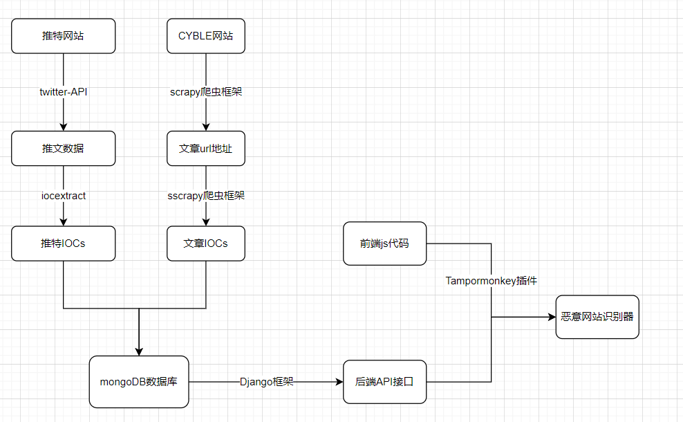
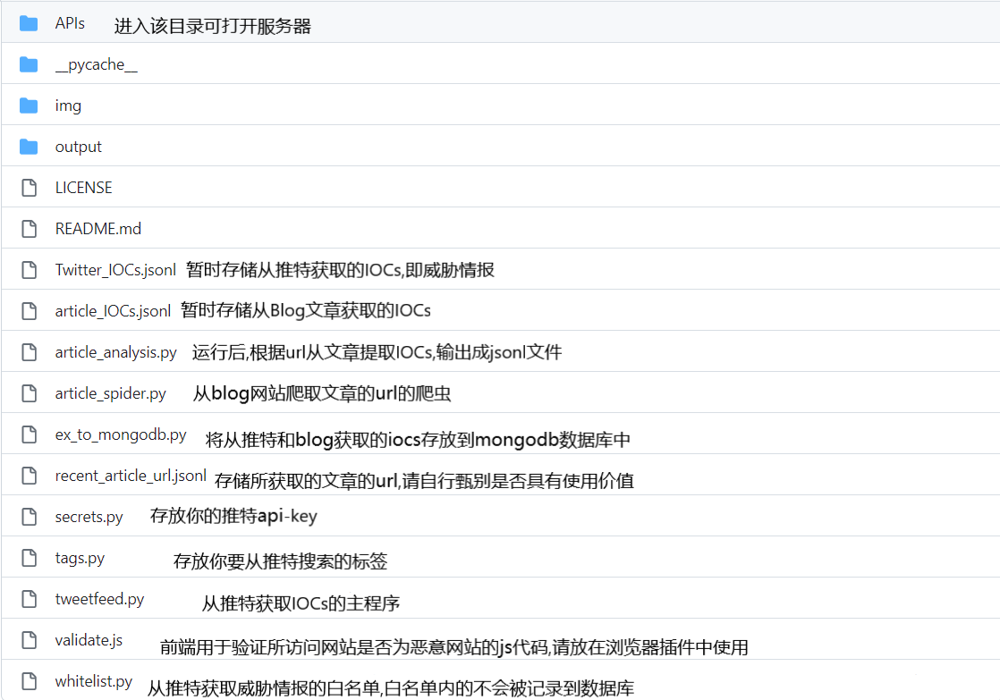
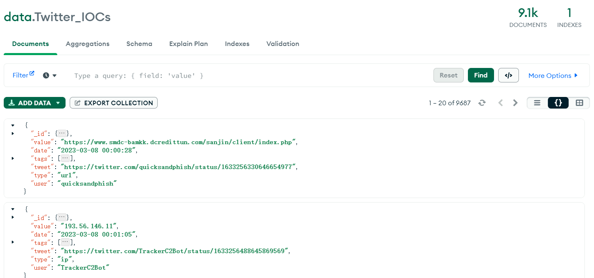
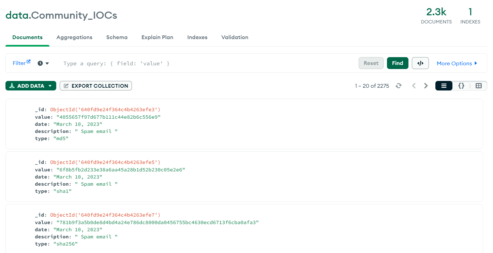

## 介绍

本项目致力于收集twitter和Blog上的威胁情报, 将其存放到mongodb,其中从推特收集信息依赖于twitter-api, 其他信息的获取依赖于网络爬虫,同时利用django框架搭建简易的本地服务器, 与mongodb进行交互, 并利用前端插件做一个危险网站识别与弹窗功能。

## 项目结构



## 库依赖

```python
# Python 3.11  windows x64
# 请通过pip命令下载以下模块
jsonlines 3.1.0
pymongo 4.3.3
iocextract 1.13.1
scrapy 2.8.0
tweepy 4.5.0
Django 4.1.7
```

## 项目文件说明



## 技术支持

```
Tampormonkey 浏览器插件.用于执行js代码,请将项目中的validate.js配置到插件中, 来自:https://www.tampermonkey.net/
MongoDB-Compass 用于可视化操作mongodb数据库, 来自:https://www.mongodb.com/products/compass
```

## 注意事项

提前将自己的Django密钥填写至APIs>APIs>Setting.py

提前将自己的推特开发者密钥填写至secrets.py

## 运行

1. CMD输入`scrapy runspider article_spider.py -o recent_article_url.jsonl` 获得最近社区文章的url, 输出为jsonl格式
2. CMD输入`scrapy runspider article_analysis.py -o article_IOCs.jsonl`爬虫获取所有文章的IOCs,输出为jsonl格式
3. CMD输入 `py tweetfeed.py`获取最近的推文中的IOCs
4. 运行`ex_to_mongodb.py`文件(需db要提前在mongdb-compass中配置好数据库参数,默认地址为:mongodb://localhost:27017/)
5. 在`manage.py`的目录下运行命令`python manage.py runserver 8001`
6. 将`validate.js`中的代码复制到Tampormonkey插件

## 效果图





> 仅进行演示, 不代表所访问网站为恶意网站


